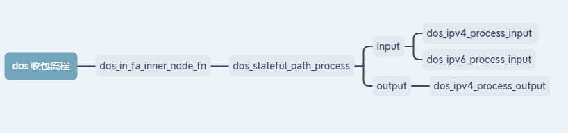

# ddos 笔记

## 1.	启动流程

```shell
一个终端启动vpp，vpp启动之后另一个终端输入 make run-vat
dos_policy_add ipv4 permit+reflect src 0.0.0.0/0 dst 0.0.0.0/0 icmpflood 10 30 synflood 3 30 udpflood 3 30 icmpv6 3 30 syncookie by_src #包含所有ip
dos_interface_set_dos_list sw_if_index 1 input 0 output 0  #sw_if_index 对应 show int 下标地址  
在vpp 输入 show dos policy 查看是否配置成功
配置靶机和虚拟机测试
hping3 --flood ip
```

## 2.	过包流程



```shell
从收包函数 dos_in_fa_inner_node_fn() -> dos_stateful_path_process（）ddos处理流程函数,然后判断ipv4和ipv6(in/out)
```

