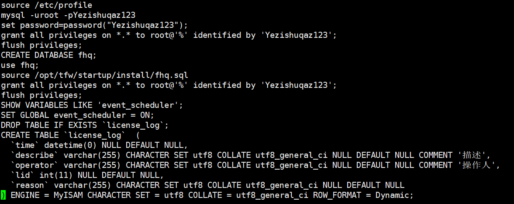
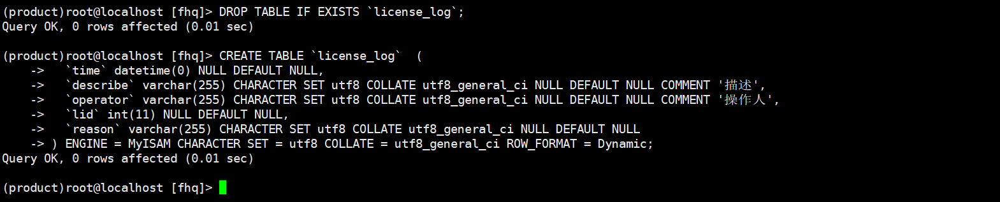
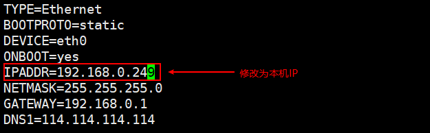
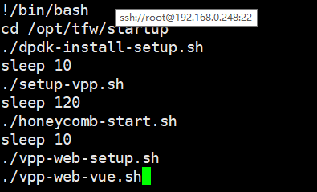
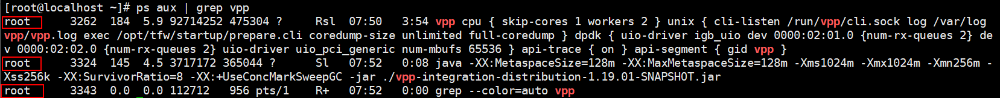
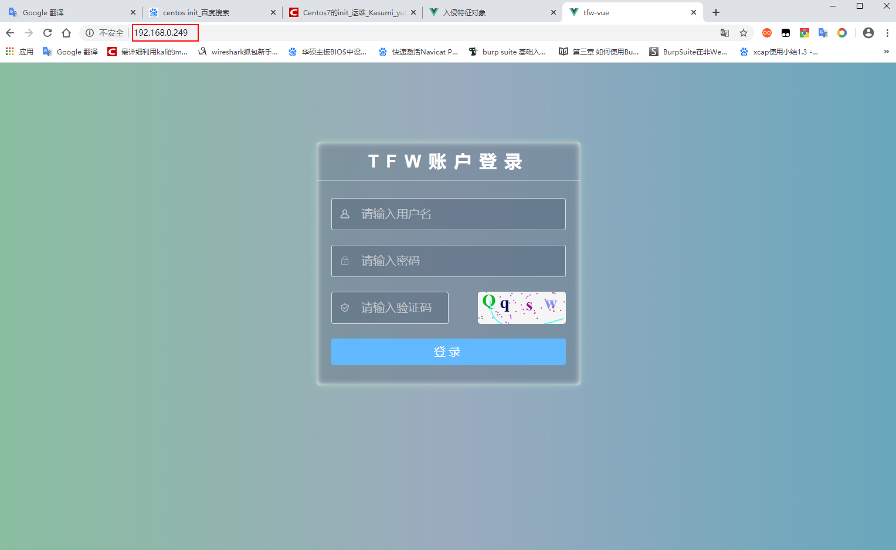

# 防火墙搭建流程


```shell
173
scp tfw-install-1.18-rc0.tar.gz root@192.168.0.248:/root/
成功后传输到 248，之后在248进行安装
248
mkdir /opt/tfw  
tar -zxvf tfw-install-1.18-rc0.tar.gz -C /opt/tfw/  在root目录下
cd /opt/tfw/startup/install
./starting-rpm.sh
cat mysql-write.sh 
```



```shell
将mysql-write.sh文件中这段话复制到命令行执行
```



```shell
执行完毕
```



```shell
vi /etc/sysconfig/network-scripts/ifcfg-eth0 
把ip修改为本机IP，然后保存退出
cp -rf /opt/tfw/web-vue/nginx /usr/local/ 复制文件夹到local目录下
```



```shell
vi /opt/tfw/startup/tfw-start.sh   进入上面这个文件
将规则全部放开
设置vpp sleep 120
保存退出
service network restart //重启
reboot //重启虚拟机
```



```shell
重启之后输入 ps aux | grep vpp 
等待2min
show出上面这些内容 说明安装成功
```



```shell
在浏览器输入ip地址，查看是否链接成功
```

