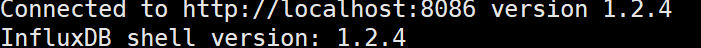

# http访问influxdb使用文档

1. 虚拟机上开启`influxdb`

2. 

3. 在web端输入http://192.168.0.173:8083 //本机ip，端口 8083

4. 

5. 查询语句

6. ```shell
   influx -username root -password Yezishuqaz123  //账号密码登录
   show databases   //查询当前数据库
   show measurements  //查询当前这个数据库中所有数据表
   select * from bl_city //查询表中数据
   select * from "tfw_1h".bl_city //查询保留策略中的数据 
   ```

7. 