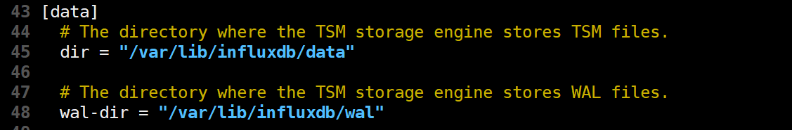
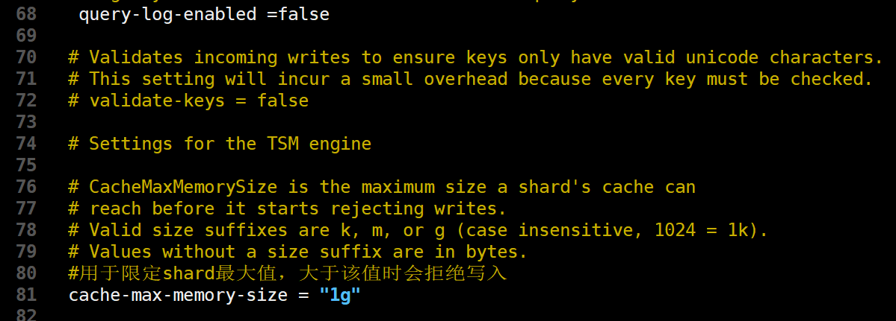
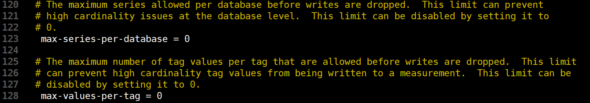
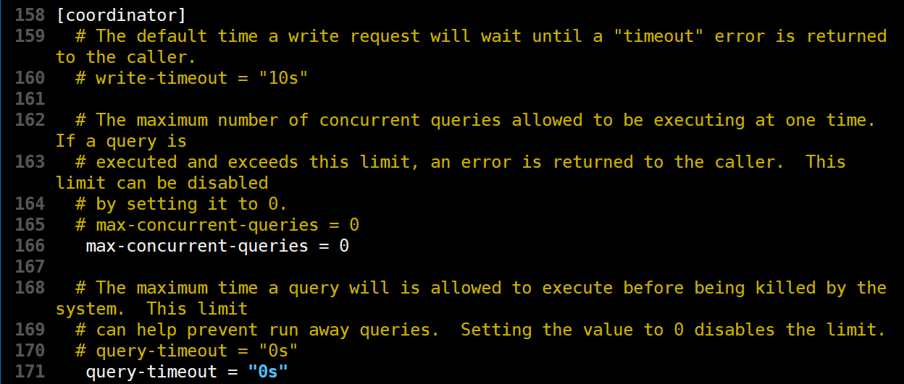
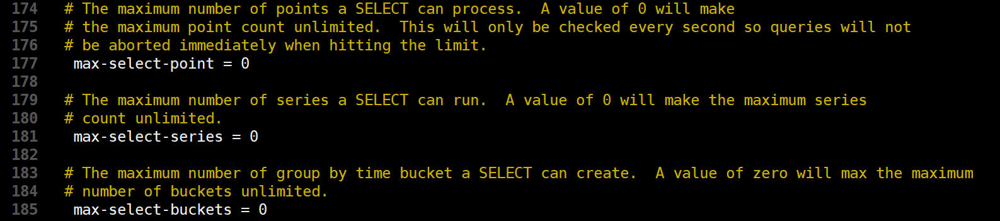
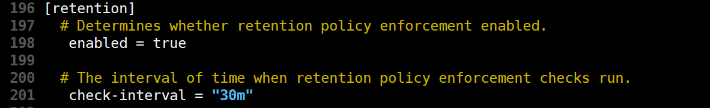
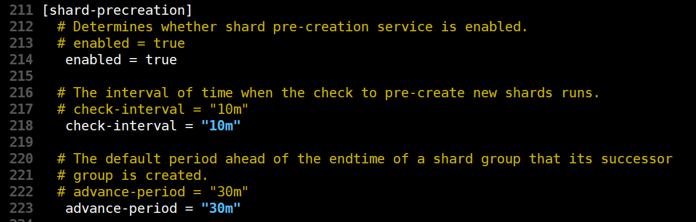
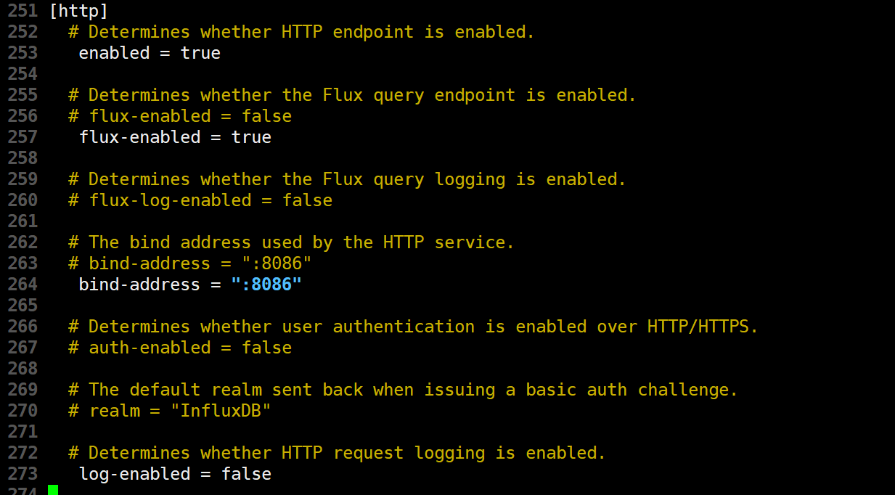
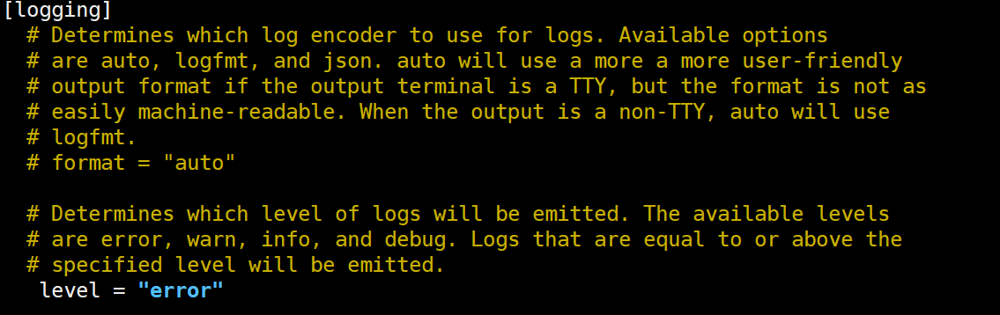
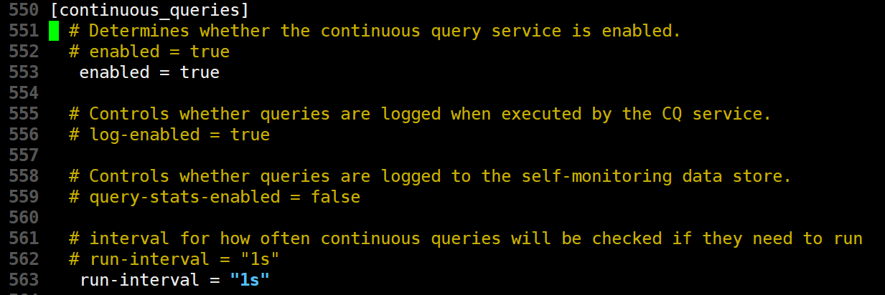

# influx 配置文件修改

## 1.	meta


```shell
dir = "/var/lib/influxdb/meta"   #meta数据存放目录
```

## 2.	data








```shell
dir = "/var/lib/influxdb/data"   #最终数据（TSM文件）存储目录
wal-dir = "/var/lib/influxdb/wal"  # 预写日志存储目录
query-log-enabled =false   # 是否开启tsm引擎查询日志
cache-max-memory-size = "1g"   # 用于限定shard最大值，大于该值时会拒绝写入
max-series-per-database = 1000000  # 限制数据库的级数，该值为0时取消限制，默认值：1000000
max-values-per-tag = 100000  # 一个tag最大的value数，0取消限制，默认值：100000
series-id-set-cache-size = 100 
```

## 3.	coordinator





```shell
max-concurrent-queries = 0  # 最大并发查询数，0无限制
query-timeout = "0s"   # 查询操作超时时间，0无限制
max-select-point = 0  # SELECT语句可以处理的最大点数（points），0无限制，默认值：0
max-select-series = 0  # SELECT语句可以处理的最大级数（series），0无限制，默认值：0
max-select-buckets = 0  # SELECT语句可以处理的最大"GROUP BY time()"的时间周期，0无限制，默认值：0
```

## 4.	retention



```shell
enabled = true  #是否启用保留策略
check-interval = "30m"  #检查时间为 30m
```

## 5.	shard-precreation



```shell
enabled = true # 是否启用该模块，默认值 ： true
check-interval = "10m"  # 检查时间间隔，默认值 ："10m"
advance-period = "30m"  # 预创建分区的最大提前时间，默认值 ："30m"
```

## 6.	http



```shell
enabled = true  #是否启用http
flux-enabled = true  #是否启用流查询端点
bind-address = ":8086" #绑定地址8086
log-enabled = false  #是否启用http请求日志记录
```


```shell
auth-enabled = false  #开启登录验证，改为true，重启服务即可
```

## 7.	logging



```shell
level = "error"  #发出的日志级别为 error
```

## 8.	continuous_queries



```shell
enabled = true  #开启cq查询服务
run-interval = "1s"  #cq运行时，查询间隔
```

