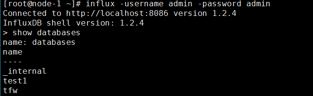
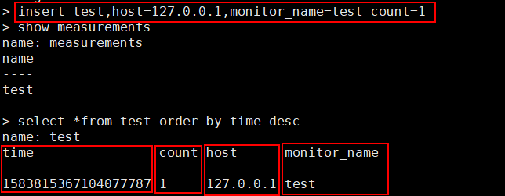
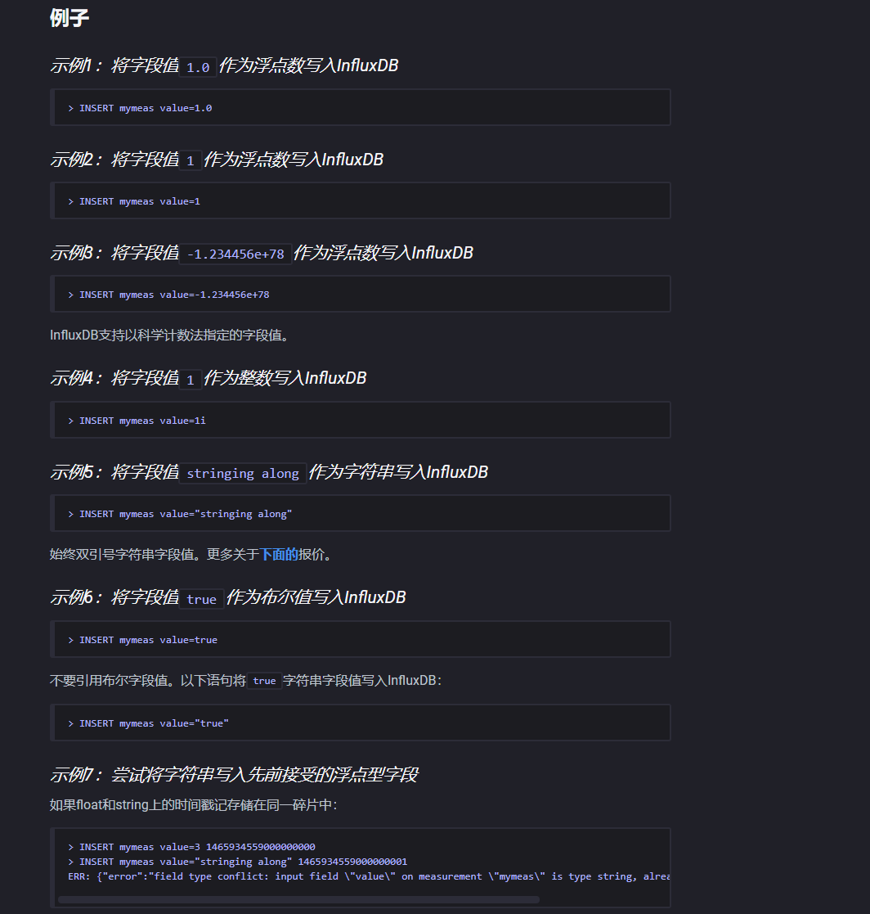
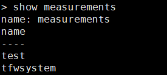
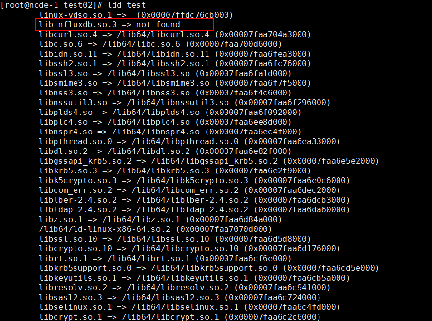
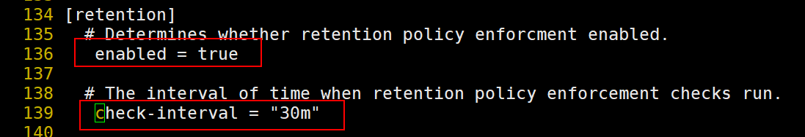
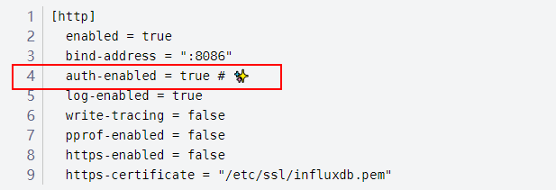
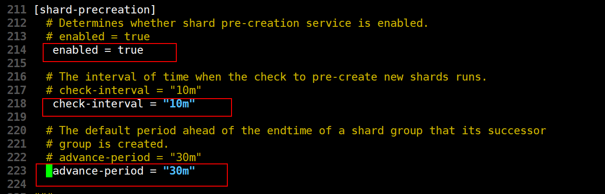

# influxdb centos下安装以及使用

# 下载

```shell
wget https://dl.influxdata.com/influxdb/releases/influxdb-1.2.4.x86_64.rpm
wget https://dl.influxdata.com/influxdb/releases/influxdb-1.7.7.x86_64.rpm  #//1.7.7
```

# 安装

```shell
 sudo yum localinstall influxdb-1.2.4.x86_64.rpm 
 sudo yum localinstall influxdb-1.7.7.x86_64.rpm
```

# 启动服务

```shell
'版本为7.2 查询命令' cat /etc/redhat-release
service influxdb start #7.0以下 
systemctl start influxdb #7.0以上 
systemctl status influxdb #查看服务状态
#经测试两种命令都可以进入
```

# 进入数据库

```shell
influx
```

# 创建用户

```sql
CREATE USER "root" WITH PASSWORD 'Yezishuqaz123' WITH ALL PRIVILEGES
```

# 退出

```sql
exit
```

# 使用账户密码登入


```shell
influx -username admin -password admin
influx -username root -password Yezishuqaz123
```

# 停止服务

```shell
systemctl stop influxdb
```

# 使用方法



```sql
influx -username root -password Yezishuqaz123  --账号密码登录
show databases   --查询当前数据库名字
create database test1    --创建数据库
```






```sql
use test1  --使用库
insert student age=18,count=1 --不插入tag字段
insert test,host=127.0.0.1,monitor_name=test count=1  --插入
insert disk_free,hostname=server01 value=442221834240i

target，failed  target为string类型  failed为float int string bool
	--如果要输出string类型  /"abc/"  使用转义字符/来输出
select * from test  --查询插入的数据
precision rfc3339 --修改时间格式
tz('Asia/Shanghai') --显示东八区时间
influx -ssl -unsafeSsl -host 192.168.0.173 --连接https
```




```sql
show measurements  --显示这个数据库（test1）所有表
drop measurement "tfwsystem"  --删除表
drop database "db_name"  --删除库
```

# 加载库(不能使用)

```shell
git clone https://github.com/pravussum/influxdb-c
cd influxdb-c/
./bootstrap
./configure  #需要安装 libcurl yum直接安装
#测试安装是否正确 将代码tests.c 编译
gcc tests.c -o test  -L/usr/local/lib/ -linfluxdb -lcurl #引用库
./test  #启动测试 
./test: error while loading shared libraries: libinfluxdb.so.0: cannot open shared object file: No such file or directory
#提示动态库找不到 ，只要加载动态库就好
```



```shell
#输入ldd test 查看
#cd 到路径下确保有这个.so文件 把绝对路径复制一下
vi /etc/ld.so.conf #将路径保存到这里
 ldconfig -v #重启 在输入ldd查看就已有了
#此时就可以启动测试程序了
```

# 加载库

```shell
git clone https://github.com/langliverygood/InfluxdbC.git
#进入文件 直接make  //会有警告 不影响运行
vi test_all.c  #将删除库注释掉 用来测试
gcc -o test test_all.c -L. -linfluxdb -lcurl
-L /usr/local/lib -linfluxdbc -lcurl  #加载动态库
#编译成功后去数据库验证
```

# 代码测试

```shell
#在makelist添加启动程序，添加库
make build 成功后启动程序测试
/mnt/sdb/vpp/build-root/build-vpp_debug-native/vpp/bin
./vpp_get_data  #启动
gdb vpp_get_data  #测试

```


# 保留策略



```sql
--开启策略
	vi /etc/influxdb/influxdb.conf
	--将这两行打开并设置时间
CREATE RETENTION POLICY "tfw_1h" on tfw_system DURATION 1h REPLICATION 1 DEFAULT;

CREATE RETENTION POLICY "tfw_1d" on tfw_system DURATION 1d REPLICATION 1 DEFAULT;--1天为默认策略
	'tfw_1h  == 策略名
	tfw_system  == 数据库名字
	1h    == 保留时间 (最低1小时)'
show retention policies on tfw_system --连续查询结果
drop retention POLICY "tfw_1d" ON "tfw_system"  --删除连续查询
ALTER RETENTION POLICY tfw_1h ON tfw_system DURATION 1h DEFAULT --修改策略
select * from "tfw_1h".bl_city --查询保留策略中的数据
select * from "tfw_1h".interface --底层数据都会保存在 tfw_1h
```

# 修改账号认证



```shell
vim /etc/influxdb/influxdb.conf  #默认是禁止的
#将这一行的false改为true 将注释去掉
#重启influx即可 //需要账号密码登录
```


# 导入导出数据

```sql
/var/lib/influxdb/data  --数据路径
influxd backup -database tfw_system /tmp/    --导出到tmp
import "influxdata/influxdb/v1"  --导入

```


# cq查询用法

```sql
SHOW CONTINUOUS QUERIES  --查询连续查询策略
CREATE CONTINUOUS QUERY cq_30m ON tfw_system BEGIN SELECT sum(count) INTO count_sum FROM bl_city GROUP BY time(15m) END 

CREATE CONTINUOUS QUERY cq_30m ON tfw_system BEGIN SELECT sum(count) INTO count_sum FROM bl_city where city_id = '433' GROUP BY time(15m) END

CREATE CONTINUOUS QUERY cq_15m ON tfw_system BEGIN SELECT count(dest_city_id) INTO bl_ip FROM bl_log GROUP BY time(15m),src_city_id END --cq 15分钟每组有多少条信息

CREATE CONTINUOUS QUERY cq_15m ON tfw_system BEGIN SELECT count(dest_ip) INTO bl_ip FROM "tfw_1h".bl_log GROUP BY time(15m),src_ip END  

# CREATE CONTINUOUS QUERY cq_10m ON tfw_system BEGIN SELECT count(dest_ip) INTO tfw_system."tfw_1d".bl_test FROM bl_log GROUP BY time(15m),src_ip END  --测试


DROP CONTINUOUS QUERY cq_15m ON tfw_system --删除
select * from bl_city group by city_id --分组查询

```

# 使用delete删除数据

```sql
delete from student where "city_id"='11' and "src_ip"='192.168.4.2' --根据tag字段删除表中一行数据，
```

# 权限管理

```sql
GRANT ALL PRIVILEGES TO <username>
GRANT [READ,WRITE,ALL] ON <database_name> TO <username>  --授权

REVOKE ALL PRIVILEGES FROM <username>
REVOKE [READ,WRITE,ALL] ON <database_name> FROM <username>  --回收

show grants for <username>  --权限查询
```

# 进阶用法

```sql
select * from yhh group by *  --给所有tag字段分组
SELECT count(dest_city_id) FROM "bl_log" group by src_city_id  --字段src_city_id 每组有几条信息

select distinct src_count from bl_log --查询不同的下标
select sum(src_count) from bl_log   --个数
select * from bl_log where src_city_id = '433' --查询tag字段 city_id = '433'
select sum(src_count) from bl_log where src_city_id = '433' --计算`src_city_id = '433'` 的src_count值的和
insert into "test_1d" person,name=ccc age=10 //插入数据到非默认
SELECT * FROM "bl_type" order by time desc limit 10 tz('Asia/Shanghai')  --时间倒序查看 显示10条
SELECT top(count,3) FROM "bl_trend" group by ip_type tz('Asia/Shanghai') --top 3 BOTTOM 最小的
show shard groups //查看分片
SELECT COUNT(DISTINCT(LOG_BL_src_ip_field)) FROM syslog  --去重计数
SELECT * FROM "interface" ,system_info limit 10  --多表查询
```

# 数据库内存修改

```shell
# max-series-per-database = 1000000 // 数据库最大内存  改为0
# max-values-per-tag = 100000   // 每个tag最大值  改为0 不限制
[coordinator]
	write-timeout = "0s"
	max-concurrent-queries = 0
	query-timeout = "0s"
	max-select-point = 0
	max-select-series = 0
	max-select-buckets = 0
```

# log日志修改

```shell
/var/log/influxdb/  //log路径
tail -f-n 1000 influxd.log  //查看最近1000条
[meta]
	logging-enabled = true
[data]
	wal-dir = "/var/lib/influxdb/wal"  //WAL目录是预写日志的位置
	query-log-enabled = true    //启用查询日志的设置在执行之前切换已解析查询的日志记录。会记录查询中包含的所有敏感数据。
```

# 开启分片

`vi/etc/influx/influx.conf`



# 卸载

```shell
rpm -qa | grep influxdb  //查找
rpm -e --nodeps influxdb-1.2.4-1.x86_64 
```


策略记录

```sql
CREATE RETENTION POLICY "tfw_1h" on tfw_system DURATION 1h REPLICATION 1 DEFAULT; --1小时策略 默认
CREATE RETENTION POLICY "tfw_1d" on tfw_system DURATION 1d REPLICATION 1;
show retention policies on tfw_system --连续查询结果
drop retention POLICY "tfw_1d" ON "tfw_system"  --删除连续查询

CREATE CONTINUOUS QUERY cq_15m ON tfw_system BEGIN SELECT count(dest_ip) INTO bl_ip FROM "tfw_1h".bl_log GROUP BY time(15m),src_ip END  --15分钟cq结果
SHOW CONTINUOUS QUERIES  --查询连续查询策略
DROP CONTINUOUS QUERY cq_15m ON tfw_system --删除

CREATE CONTINUOUS QUERY cq_10m ON tfw_system BEGIN SELECT count(dest_ip) INTO tfw_system."tfw_1d".bl_test FROM "tfw_1h".bl_log GROUP BY time(15m),src_ip END  --从默认策略中获取数据放到非默认策略中

CREATE CONTINUOUS QUERY cq_1h ON tfw_system BEGIN SELECT count(dest_ip) INTO tfw_system."tfw_1d".bl_ip FROM bl_log GROUP BY time(1h),src_ip END //1h cq

SELECT * FROM tfw_system."tfw_1d".bl_ip --查询非默认策略中的数据
```

interface 

```sql
CREATE CONTINUOUS QUERY cq_30m ON tfw_system BEGIN SELECT mean(rx_kbps) as rx_kbps,mean(rx_mbps) as rx_mbps,mean(tx_kbps) as tx_kbps,mean(tx_mbps) as tx_mbps INTO tfw_system."tfw_1d".inter_30m FROM "tfw_1h".interface GROUP BY time(30m),inter_name END --起别名

CREATE CONTINUOUS QUERY cq_mem_30m ON tfw_system BEGIN SELECT mean(memory_rate) as mem_mean INTO tfw_system."tfw_1d".mem_vpp_30m FROM "tfw_1h".system_info GROUP BY time(30m) END --半小时内存使用率

CREATE CONTINUOUS QUERY inter_speed_10m ON tfw_system BEGIN SELECT max(rx_kbytes) as rx_max,mean(rx_kbytes) as rx_mean,mean(rx_kbytes)*8/10 as rx_rate INTO tfw_system."tfw_1d".inter_speed_count FROM "tfw_1h".interface GROUP BY time(10m),inter_name END --10m 接口速率信息


SELECT * FROM tfw_system."tfw_1d".inter_30m
```

telegraf

```sql
CREATE RETENTION POLICY "telegraf_1h" on telegraf DURATION 1h REPLICATION 1 DEFAULT;
CREATE RETENTION POLICY "telegraf_1d" on telegraf DURATION 1d REPLICATION 1;

CREATE CONTINUOUS QUERY bl_ip_1m ON telegraf BEGIN SELECT count(LOG_BL_dest_ip) INTO telegraf."telegraf_1d".bl_ip FROM "telegraf_1h".syslog GROUP BY time(1m),LOG_BL_src_ip,LOG_BL_id END  --从默认策略中获取数据放到非默认策略中

CREATE CONTINUOUS QUERY cpu_30m ON telegraf BEGIN SELECT mean(usage_user) as cpu_mean INTO telegraf."telegraf_1d".cpu_30m FROM "telegraf_1h".cpu where cpu='cpu-total' GROUP BY time(30m),cpu END


select * from telegraf."telegraf_1d".bl_ip
```

