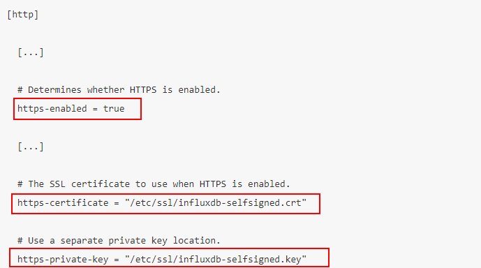
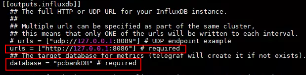
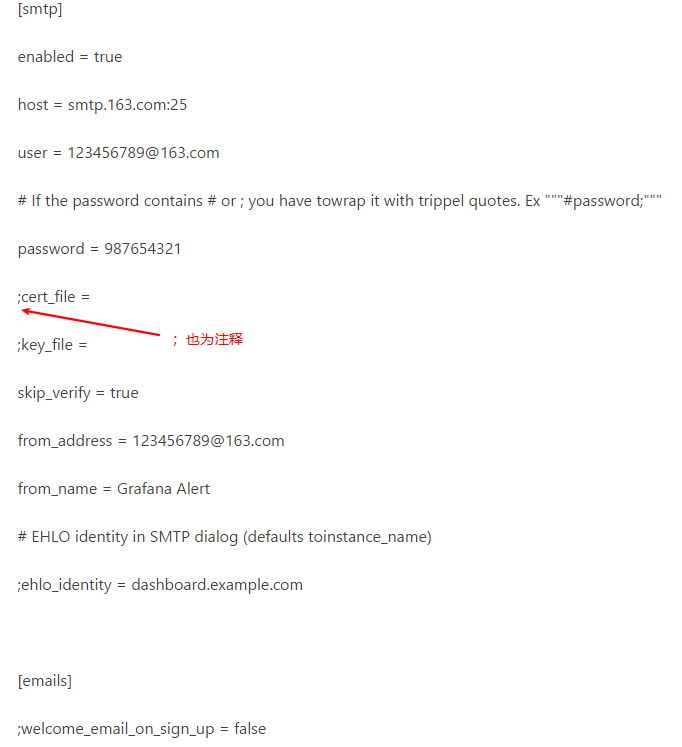
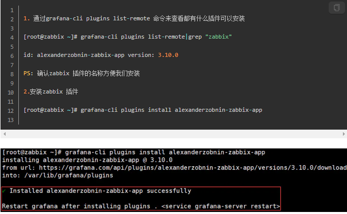
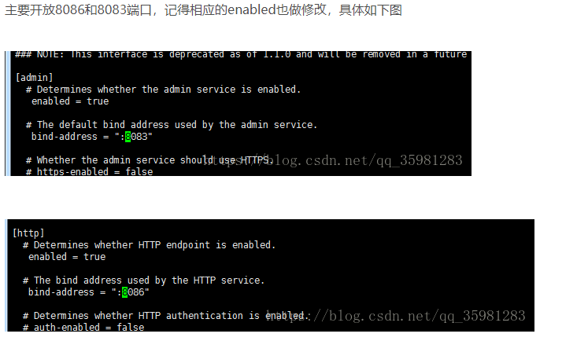

# influxdb http配置

1. 生成自签名证书

   ```shell
   sudo openssl req -x509 -nodes -newkey rsa:2048 -keyout /etc/ssl/influxdb-selfsigned.key -out /etc/ssl/influxdb-selfsigned.crt -days 30 //有效时间
   ```

2.  在InfluxDB的配置文件中开启HTTPS

   ```shell
   vi /etc/influxdb/influxdb.conf
   https-enabled设为true
   http-certificate设为/etc/ssl/influxdb-selfsigned.crt
   http-private-key设为/etc/ssl/influxdb-selfsigned.key
   ```

   

3. 重启InfluxDB使配置生效

   ```shell
   sudo systemctl restart influxdb
   ```

4. 验证https安装

   ```shell
   influx -ssl -unsafeSsl -host 192.168.0.173
   成功返回：
   	Connected to https://<domain_name>.com:8086 version 1.x.x
   	InfluxDB shell version: 1.x.x
   ```

5. 配置telegraf

   ```shell
   vi /etc/telegraf/telegraf.conf
   编辑urls设置以指定https而不是http，并将localhost更改为相关域名。 如果您使用自签名证书，请取消insecure_skip_verify的注释设置并将其设置为true。
   然后重启telegraf
   ```

6. 安装telegraf

   ```shell
   wget https://dl.influxdata.com/telegraf/releases/telegraf-1.6.0-1.x86_64.rpm
   sudo yum localinstall telegraf-1.6.0-1.x86_64.rpm
   vi /etc/telegraf/telegraf.conf 修改配置
   ```

7. 

8. 启动telegraf服务、添加开机启动

   ```shell
   systemctl start telegraf.service
   service telegraf status
   systemctl enable telegraf.service
   systemctl stop telegraf.service //关闭服务
   ```

9. Grafana的安装及配置

   ```shell
   登录https://grafana.com/grafana/download下载
   wget https://s3-us-west-2.amazonaws.com/grafana-releases/release/grafana-5.0.4-1.x86_64.rpm //二选一
   sudo yum localinstall grafana-5.0.4-1.x86_64.rpm
   ```

10. 配置Grafana告警邮箱

    ```shell
    vi /etc/grafana/grafana.ini
    /smtp 找到smtp的配置
    ```

11. 

12. 启动服务、添加开机启动

    ```shell
    systemctl daemon-reload
    systemctl start grafana-server
    systemctl status grafana-server
    systemctl enablegrafana-server.service
    systemctl stop grafana-server  //关闭
    ```

13. Grafana使用及配置

    ```shell
    登录http://192.168.0.173:3000 //localhost
    默认用户名admin，密码admin
    ```

14. granfana 插件安装

    ```shell
    yum install fontconfig freetype* urw-fonts
    PS: 服务器端图像（png）渲染是grafana的一项可选功能，在共享可视化时非常有用，例如在警报通知中。如果图像缺失文本，请确保已安装字体包。
    ```

15. 安装grafana-zabbix 插件

    ```shell
    grafana-cli plugins list-remote|grep "zabbix"
    grafana-cli plugins install alexanderzobnin-zabbix-app
    ```

    

16. 安装grafana的时钟插件

    ```shell
    grafana-cli plugins install grafana-clock-pane
    systemctl restart grafana-server //重启服务
    ```

17. http配置

    ```shell
    将上面https配置注掉
    开放8086和8083端口
    配置完成后重启服务
    sudo systemctl restart influxdb
    influx 进入
    http://192.168.0.173:8086  //web 测试
    ```

18. 

19. telegraf 配置

20. ```shell
    
    ```

21. 

​    