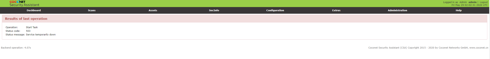
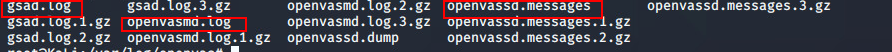
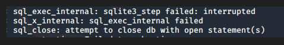
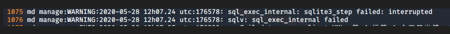
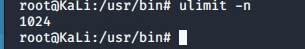

# kali ulimit 调优

## 1.	背景

```shell
虚机114在web端扫描网段时，每次只能扫描两个，超出后会报503错误(如下图)
```



```shell
后台查看
路径  cd /var/log/openvas
```



```shell
后台日志输出
```





```shell
输入命令 ulimit -n 
```



## 2.	优化

```shell
vi /etc/security/limits.conf  #解除 Linux 系统的最大进程数和最大文件打开数限制
vi /etc/profile  #修改所有 linux 用户的环境变量文件  在末尾添加
source /etc/profile  
```


