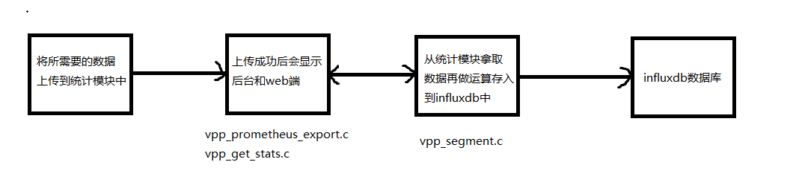

# 从统计模块获取数据

## 1.	获取数据流程图

1.1	

1.2	将所需要的数据放入到vpp统计模块中，如果插入成功，会在统计模块中show出来。

1.3	查看命令(需要先启动vpp)

```shell
vpp_get_stats dump   //后台显示
web端显示
	vpp_prometheus_export .*  //后台先输入命令
	http://192.168.0.176:9482/metrics  //wen端输入ip 
```

## 2.	vpp_segment.c中获取数据流程

2.1	

```c
	stat_segment_main_t *sm = &stat_segment_main;
	stat_segment_directory_entry_t *show_data, *ep; 
	
	/*将数据放入show_data中，然后解锁*/
	vlib_stat_segment_lock ();
	show_data = vec_dup (sm->directory_vector);
	vlib_stat_segment_unlock ();

	vec_sort_with_function (show_data, name_sort_cmp);	
	counter_t **counters; //用来存放统计模块中的数据(二维数组)
	uint64_t *offset_vector;
	vnet_main_t *vnm = vnet_get_main ();

	/*将show_data中数据循环赋值到ep中*/
	vec_foreach(ep,show_data)
    {
        switch(ep->type)
        {
			/*选择统计类型*/
            case STAT_DIR_TYPE_COUNTER_VECTOR_SIMPLE:
            {
				if (ep->offset == 0)
				{
					break;
				}
                
                counters = stat_segment_pointer (sm->shared_header, ep->offset);
                offset_vector = 
                    stat_segment_pointer (sm->shared_header, ep->offset_vector);
                counter_t *cb;
                //遍历统计模块中的二维数组，获取所需要的数据
					for(int tid = 0; tid < vec_len (counters); tid++)
					{
						cb = stat_segment_pointer (sm->shared_header, offset_vector[tid]);
						
						for(int index_city = 0; index_city < vec_len(cb); index_city++)
						{	

								ip_total[index_city] += counters[tid][index_city]; 								
						}						
					}                
            }
                
		    default:
      			break;	                
        }
        vec_free(show_data);  //结束时释放
    }
```

