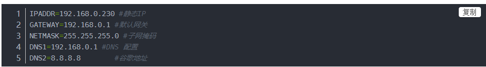

## 申请释放内存

```shell
vec_validate(V,I) 分配内存  v 指针 I 分配大小
vec_free(v) 释放 //v是一级指针
```

## format or unformat

```shell
format 功能等同于c的 sprintf //拼接
unformat 功能等同于c的 sscanf //拆分
转换为字符串
		u8 *memory_s = format(0,"%U%c",format_msize, memory);
							
```

## 指定ping包大小

```shell
ping 192.168.0.173 -l 1024 -n 2 //2 发送两次
hping3 -S -d 1024 192.168.4.4 
hping3 -c 1000 -d 5000 -S --flood 192.168.4.3 //发送1000个包，每个包大小为5000
```

## ip协议号 (常用)

```shell
1 ICMP
2 IGMP
6 TCP
17 UDP
88 IGRP
89 OSPF
```

## vim删除文件中所有内容的方法

```shell
#任意一个都可以
:%d  #不管光标在哪里，删除所有
gg dG #gg的意思是光标切换到第一行
```

## 正则表达式 

```shell
^    匹配输入字符串开始的位置。
$    匹配输入字符串结尾的位置。
^(?!#) #忽略首字符为#
```

## tcprepaly

```shell
tcpreplay -i eth1 -M 500 -l 10 /root/1.pcap
```

## ips 启动流程

```shell
make run-vat
ips_acl_add_replace ipv4 permit+reflect src 0.0.0.0/0
ips_acl_rule_object_update ips-index 0 object-index 2
ips_acl_interface_set_acl_list sw_if_index 1 input 0 output 0

show ips-acl-plugin acl //show
```

## 查看22端口是否开启

```shell
netstat -ntpl | grep 22
```

## scp时保留着虚拟机更新前信息

```shell
 ssh-keygen -R 192.168.0.222
```

## 修改虚拟机ip信息

```shell
cd  /etc/sysconfig/network-scripts/
vi ifcfg-ens32  
service network restart  //重启 输入ip addr 查看是否修改正确
arp -a //查看局域网内所有的ip
```



## centos卸载软件(rpm)

```shell
rpm -qa | grep influxdb  //查找
rpm -e --nodeps influxdb-1.2.4-1.x86_64 
```

## vimrc简单配置

```shell
git clone --depth=1 https://github.com/amix/vimrc.git ~/.vim_runtime
sh ~/.vim_runtime/install_awesome_vimrc.sh
```

## 207 环境

```shell
export OPENSSL_ROOT_DIR=/mnt/sdb/openssl-OpenSSL_1_1_1d/

```

## windows 取消更新

```shell
win+r -> gpedit.msc
管理模板
windows组件
windows更新  #3个禁用
```


