选择接口

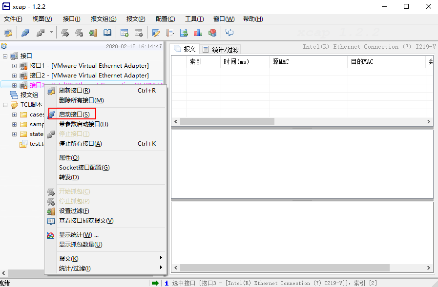

```shell
用完后记得关闭，否则退不出去
```

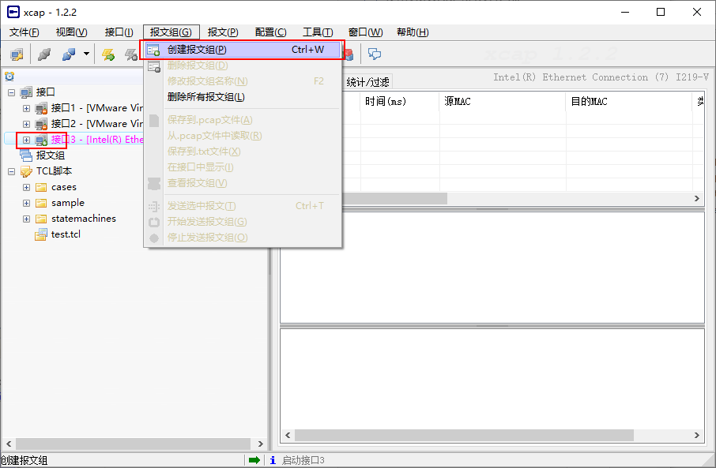

```shell
启动之后接口3 变为绿色图标
点击报文组创建
```

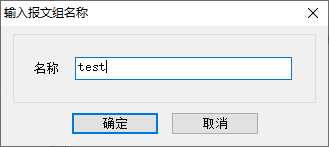


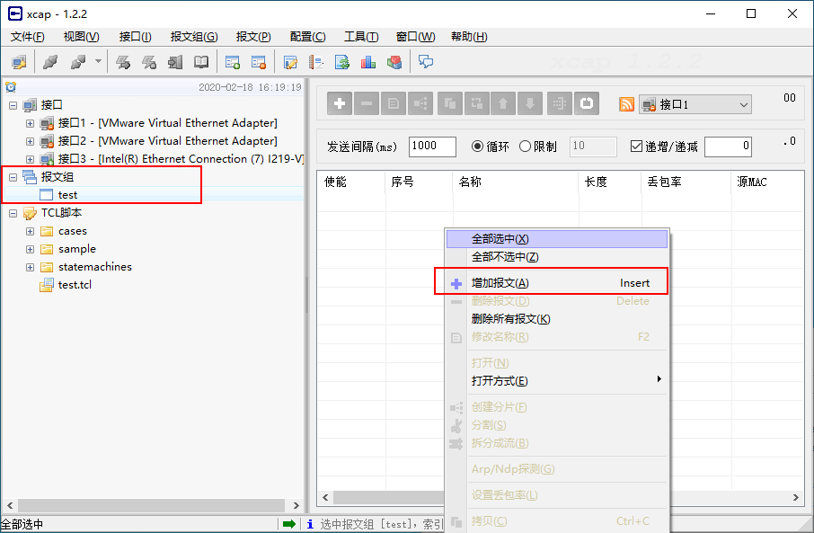

```shell
左边是添加完的报文组 test
在主界面点击右键选择添加报文
将保存好的包添加进来进行下一步操作（.pcap）
```

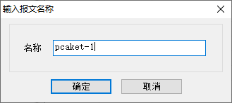

```shell
输入包的名字
```

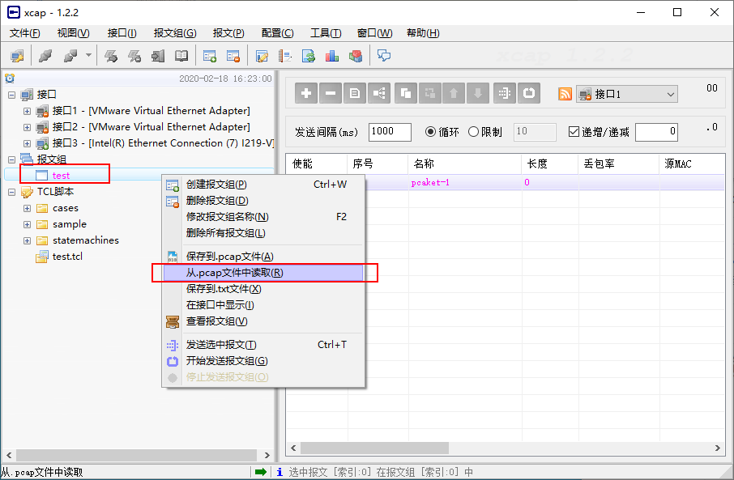

```shell
右键点击左侧test报文组选择从文件中读取
```

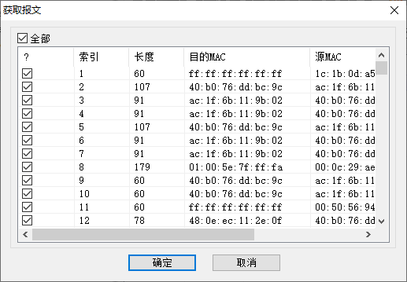

```shell
等待报文载入进去，就可以操作了
```


报文的使用以及修改

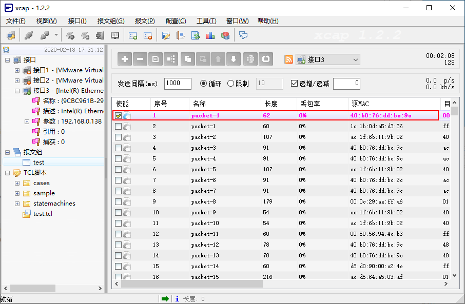

```shell
添加完之后的数据
第一条为自己手动添加的数据，开始为空
选中第一条报文，鼠标双击进入
```

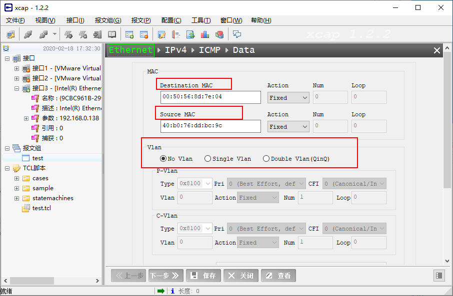

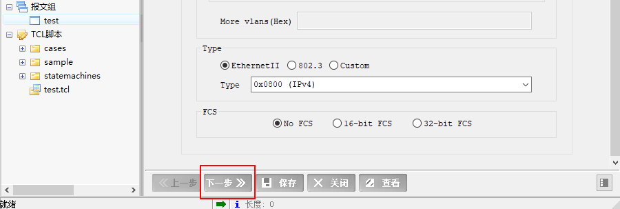

```shell
打开cmd窗口 arp -a or ipconfig/all  查看物理地址（本机138和173为实验）
Vlan 不需要更改
Type，选择以太网二，IPv4
然后点击下一步
```

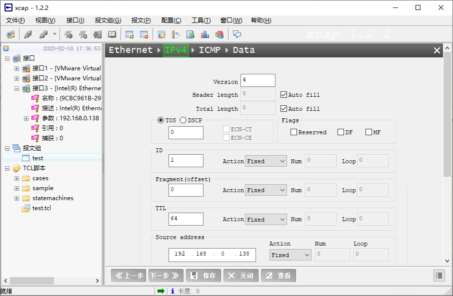

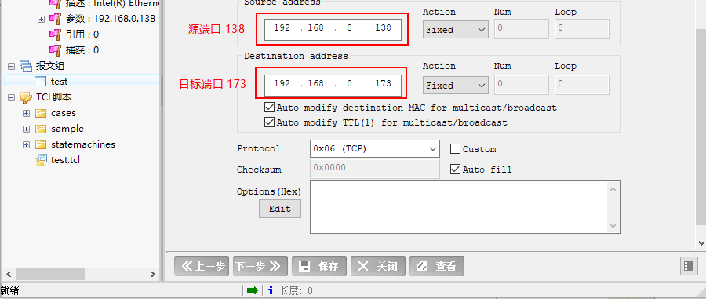

```she
只需要添加源端口和目标端口即可
Protocol 选择通讯协议，这里选择的是icmp，截图的时候显示不对
然后点击下一步
```

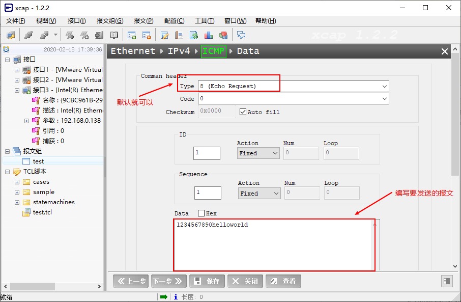

~~~shell
编写完毕后保存，点击关闭
报文就编写成功了
~~~

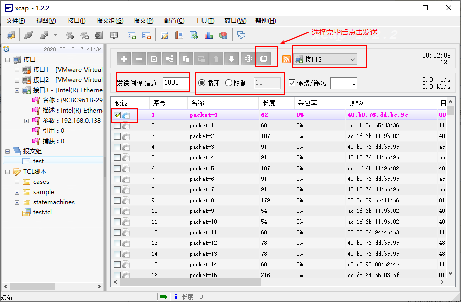

然后可以去wires hark去验证是否修改成功

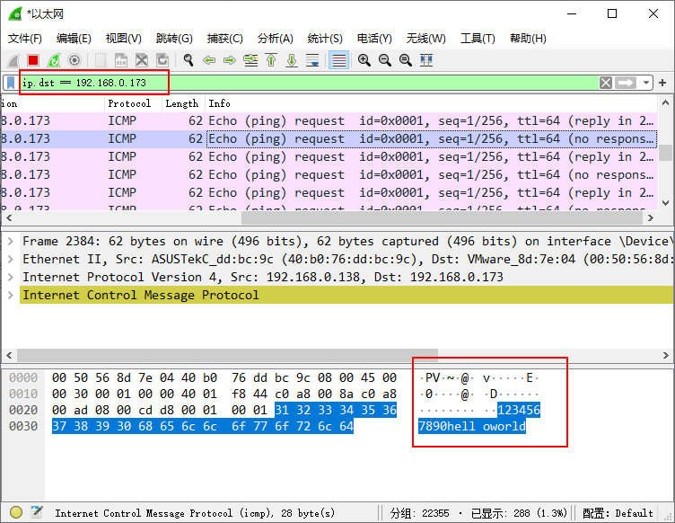

