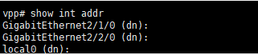
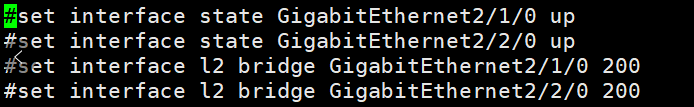
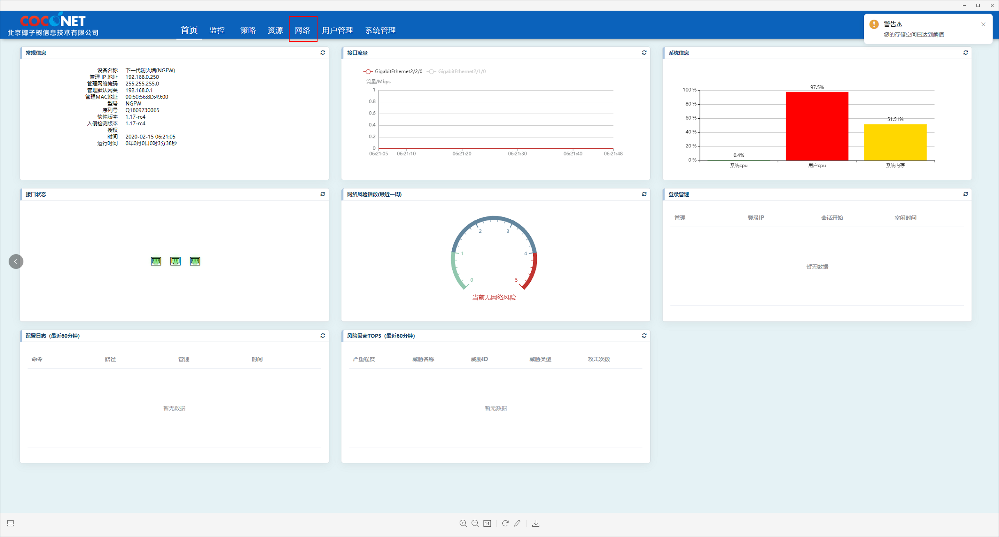
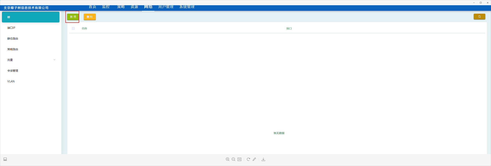
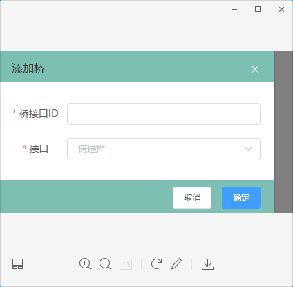
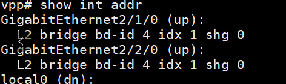

为了使两端的虚拟机可以交互，需要在之前搭建好桥，以250为例

刚开始启动的时候



解决办法

```shell
cd opt/tfw/startup
vi prepare. cli  //进入里面设置 把最上面两个打开如下图
```




保存之后重启

```shell
登录 192.168.0.250
administrator  //账号
1234qwer  //密码
```

进入之后点击网络



点击新增



```shell
id随便写
接口选刚刚那两个  //两个同时选上
```



确定之后去底端查看成功

