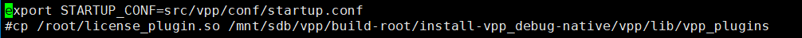
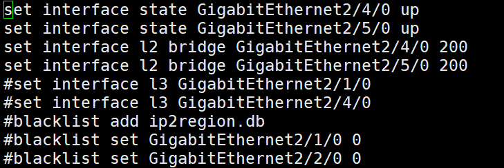

# 桥搭配的一些问题


```shell
编译机两端接口分别跟kali和win7保持一致
点击虚拟机->设置 然后弹出窗口 网络适配器来进行设置
配置好之后达赖编译机进行测试是否配置成功
```


```shell
cd /mnt/sdb/vpp 进入vpp目录
vi prepare.cli 进入（上图），把前四个打开
```



```shell
vi ln.sh
按照图上操作，保存退出
./dpdk.sh  启动dpdk
```


```shell
启动vpp
show int addr 查看是否配置成功
```

# 搭配桥流程

1. `dpdk-devbind -s`  //查询需要绑定哪个口

2. 

3. `cd /mnt/sdb/vpp`  //进入这个路径

4. 

5. ```shell
   vi dpdk.sh
   将36 37 启动 桥是4和5 
   vi ln.sh
   复制里面的启动路径，进入路径下面的`startup.conf` 进行修改
   ```

6. 

7. ```shell
   将接口改为4和5 //保存退出
   vi prepare.cli 将4 5 口打开，
   然后将桥和接口启动，进行测试
   ```

8. 