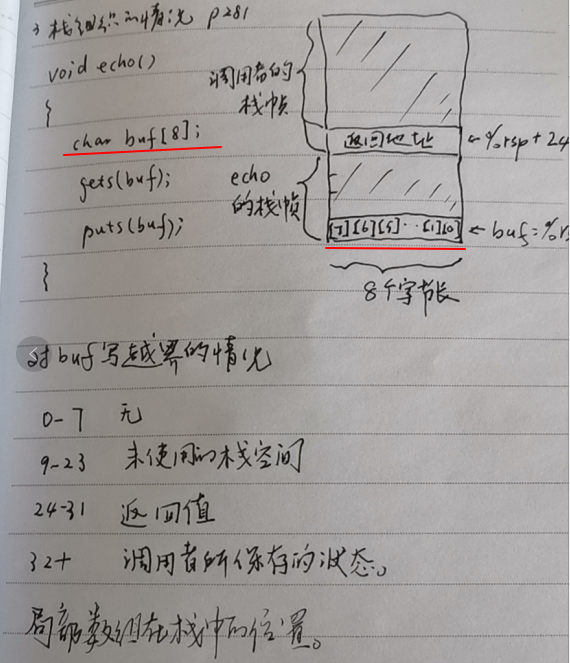
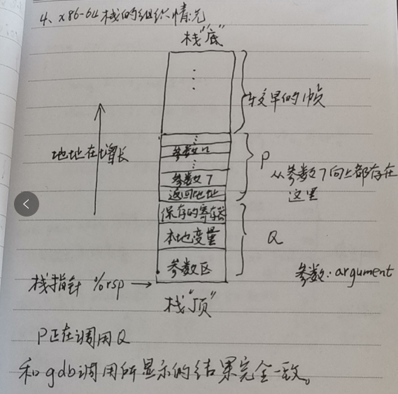
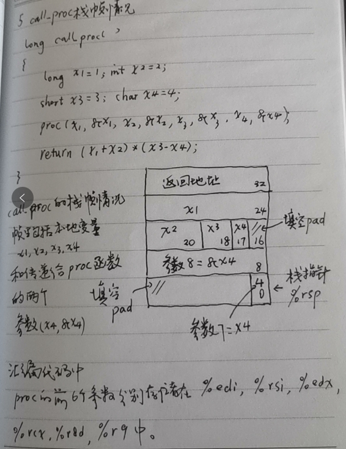

```c
void echo()
{
    char buf[8];
    gets(buf);
    puts(buf);
}
```


```shell
在32位下，定义一个char型数组，系统会预先分配32个字节
如果被恶意占用，会产生严重后果。
对buf越界的情况
0-7 无  // 系统已经分配8个字节，无异常
8-23  // 未使用的栈空间  
24-31  //返回值 例如输入计算器calc.exe，程序结束后会打开计算机
32+ //调用者所保存的状态 
```




```shell
栈指针 sp
r 寄存器
```




